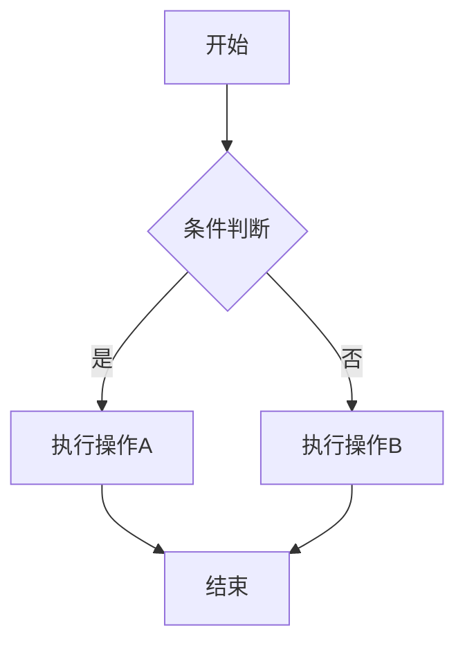
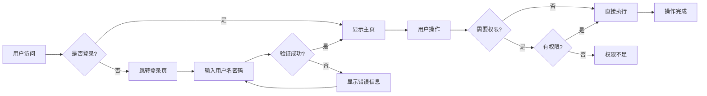
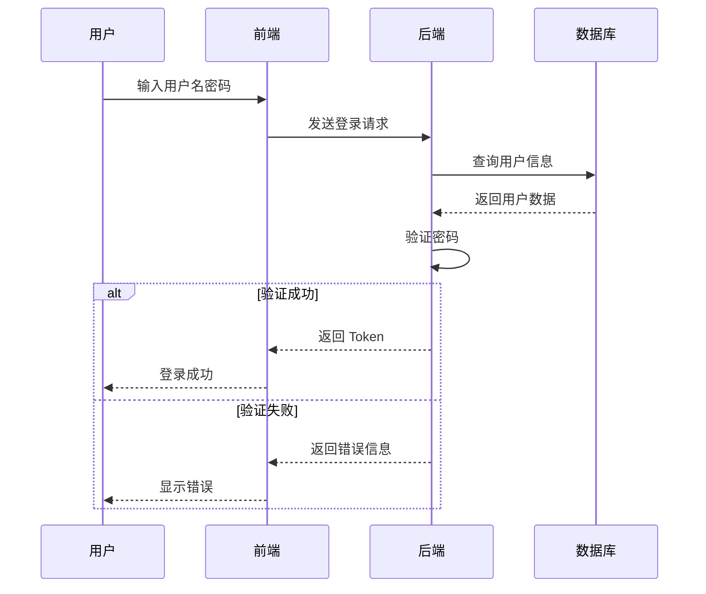
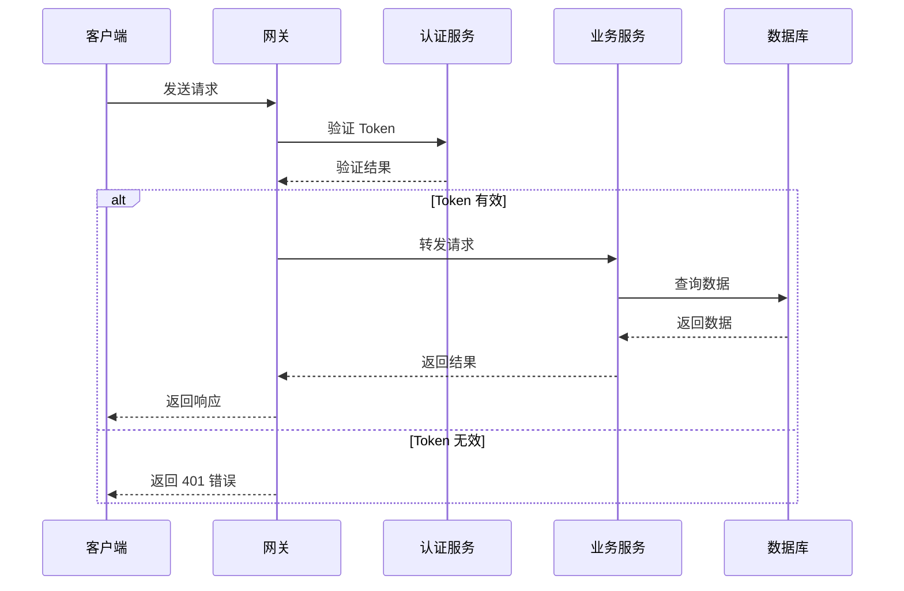
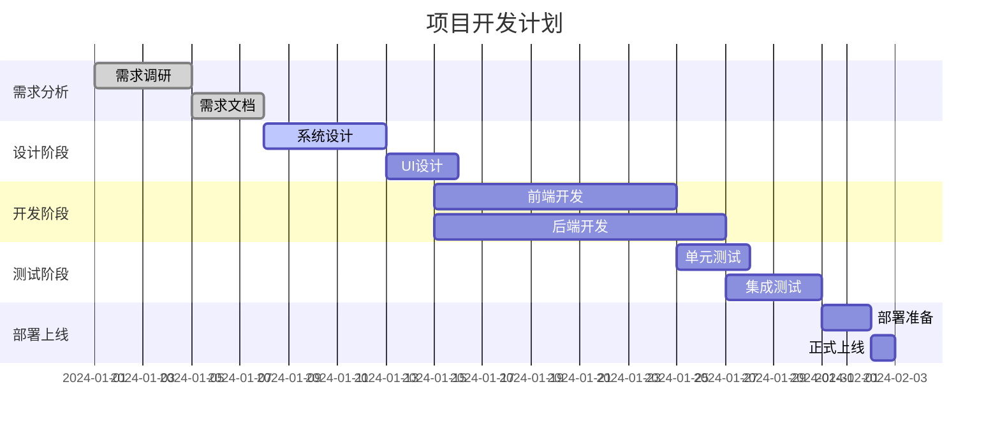
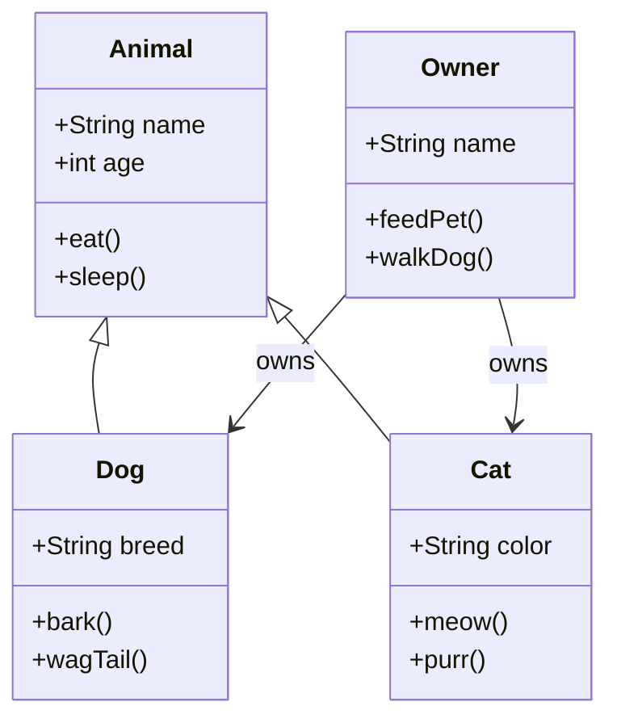
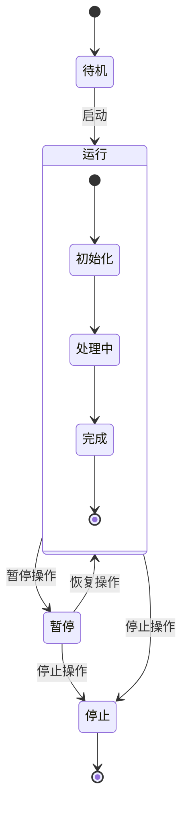
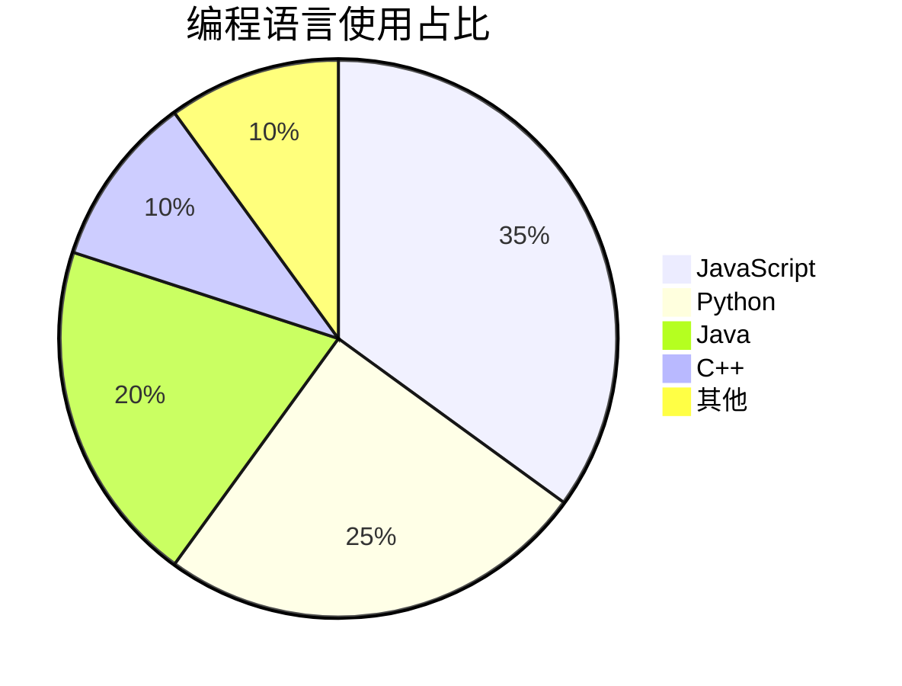
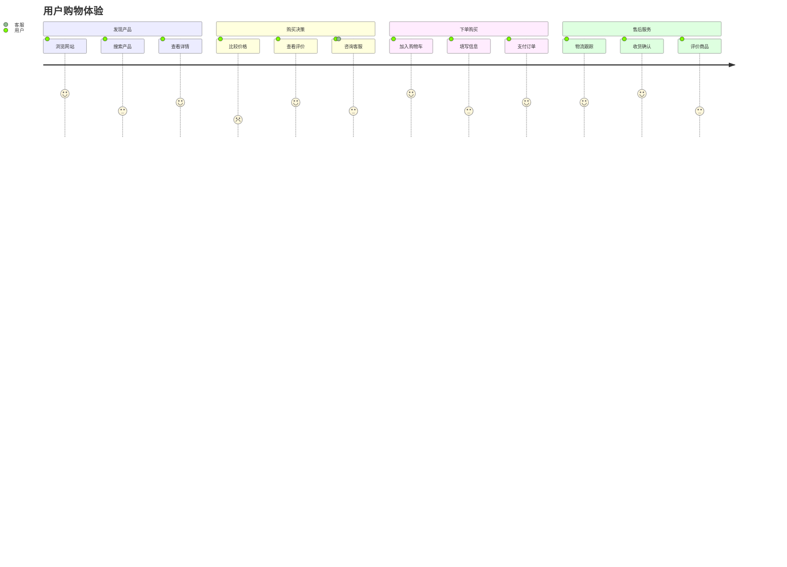

# Mermaid 流程图展示

本文展示了 Mermaid 的各种图表类型。

## 流程图 (Flowchart)

### 基础流程图


### 复杂流程图


<!-- more -->

## 时序图 (Sequence Diagram)

### 用户登录时序图


### API 调用时序图


## 甘特图 (Gantt Chart)



## 类图 (Class Diagram)



## 状态图 (State Diagram)



## 饼图 (Pie Chart)



## Git 图 (Git Graph)

```mermaid
gitgraph
    commit id: "初始提交"
    branch develop
    checkout develop
    commit id: "添加功能A"
    commit id: "修复bug"
    checkout main
    merge develop
    commit id: "发布v1.0"
    branch feature
    checkout feature
    commit id: "开发功能B"
    checkout develop
    commit id: "优化性能"
    checkout feature
    commit id: "完成功能B"
    checkout develop
    merge feature
    checkout main
    merge develop
    commit id: "发布v1.1"
```

## 用户旅程图 (User Journey)



## 总结

Mermaid 提供了丰富的图表类型：

- **流程图**: 展示业务流程和逻辑关系
- **时序图**: 描述系统间的交互过程
- **甘特图**: 项目进度和时间规划
- **类图**: 面向对象设计的类关系
- **状态图**: 系统状态转换
- **饼图**: 数据占比展示
- **Git图**: 版本控制流程
- **用户旅程图**: 用户体验流程

这些图表让技术文档更加直观易懂！
