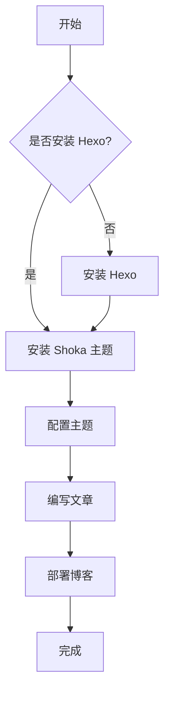
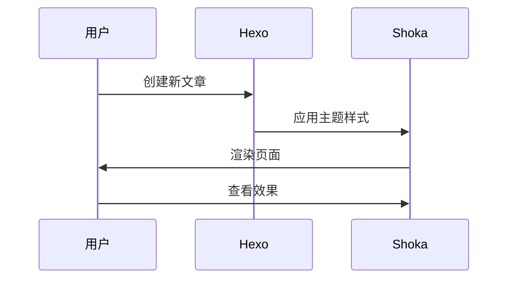

# Shoka 主题功能全面展示

本文展示了 Shoka 主题的各种强大功能。

## 🔗 友链展示


- site: 優萌初華
  owner: 霜月琉璃
  url: https://shoka.lostyu.me
  desc: 琉璃的医学 & 编程笔记
  image: https://cdn.jsdelivr.net/gh/amehime/shoka@latest/images/avatar.jpg
  color: "#e9546b"
- site: Hexo 官网
  url: https://hexo.io
  desc: 快速、简洁且高效的博客框架
  color: "#0e83cd"


## 💻 代码块展示

```javascript 高亮示例 https://developer.mozilla.org/zh-CN/docs/Web/JavaScript 参考文档 mark:2,5-7
// JavaScript 函数示例
function greetUser(name) {
    if (!name) {
        return "Hello, Guest!";
    }
    const greeting = `Hello, ${name}!`;
    console.log(greeting);
    return greeting;
}

greetUser("张三");
```

```bash 命令行示例 command:("[root@localhost] $":1,3||"[user@server] #":5-6)
pwd
/home/user/projects
ls -la
total 16
drwxr-xr-x 3 user user 4096 Jan  3 14:00 .
drwxr-xr-x 5 user user 4096 Jan  3 13:30 ..
```

<!-- more -->

## 🎯 练习题展示

1. Hexo 是一个基于 Node.js 的静态博客框架。 {.quiz .true}

2. 下列哪些是 Shoka 主题的特色功能？ {.quiz .multi}
   - 友链展示 {.correct}
   - 代码高亮 {.correct}
   - 数学公式支持 {.correct}
   - 视频播放
   {.options}
   > - ✅ 支持友链卡片展示
   > - ✅ 支持多种代码高亮
   > - ✅ 支持 KaTeX 数学公式
   > - ❌ 不是主要特色功能
   > {.options}

3. Shoka 主题基于 [Hexo]{.gap} 框架开发。 {.quiz .fill}

## 🎨 文字特效展示

++ 下划线效果 ++
++ 波浪线效果 ++{.wavy}
++ 着重点效果 ++{.dot}
++ 彩色下划线 ++{.primary}
~~ 删除线效果 ~~
== 荧光高亮效果 ==

[赤橙黄绿青蓝紫]{.rainbow}
[红色文字]{.red} [蓝色文字]{.blue} [绿色文字]{.green}

快捷键示例：[Ctrl]{.kbd} + [C]{.kbd .primary}

## 🔒 隐藏文字展示

!! 这是隐藏的内容，鼠标悬停显示 !!
!! 这是模糊的内容，选中文字显示 !!{.blur}

## 🏷️ 标签展示

[默认]{.label} [主要]{.label .primary} [信息]{.label .info} 
[成功]{.label .success} [警告]{.label .warning} [危险]{.label .danger}

## 📝 提醒块展示

:::info 信息提示
这是一个信息提示块，用于显示重要信息。
:::

:::success 成功提示
这是一个成功提示块，表示操作成功完成。
:::

:::warning 警告提示
这是一个警告提示块，提醒用户注意。
:::

:::danger 危险提示
这是一个危险提示块，警告用户潜在风险。
:::

## 📑 标签卡展示

;;;demo1 前端技术
### HTML
超文本标记语言，用于创建网页结构。

### CSS
层叠样式表，用于网页样式设计。
;;;

;;;demo1 后端技术
### Node.js
基于 Chrome V8 引擎的 JavaScript 运行环境。

### Python
简洁优雅的编程语言，适合快速开发。
;;;

## 📁 折叠块展示

+++ primary JavaScript 基础知识
JavaScript 是一种高级的、解释型的编程语言。

```javascript
const message = "Hello, World!";
console.log(message);
```
+++

+++ success CSS 样式技巧
CSS 可以让网页变得更加美观。

- 使用 Flexbox 布局
- 响应式设计
- 动画效果
+++

## ✅ 待办事项展示

- [x] 学习 Hexo 基础
- [x] 安装 Shoka 主题 {.success}
- [ ] 配置主题功能
- [ ] 编写第一篇文章 {.primary}

## 🔤 注音展示

{可愛い犬^か・わい・いいぬ}
{Hello^你好}
{Hexo^静态博客框架}

## 🧮 数学公式展示

行内公式：$E = mc^2$

块级公式：
$$
\begin{align}
\nabla \times \vec{\mathbf{B}} -\, \frac1c\, \frac{\partial\vec{\mathbf{E}}}{\partial t} &= \frac{4\pi}{c}\vec{\mathbf{j}} \\
\nabla \cdot \vec{\mathbf{E}} &= 4 \pi \rho \\
\nabla \times \vec{\mathbf{E}}\, +\, \frac1c\, \frac{\partial\vec{\mathbf{B}}}{\partial t} &= \vec{\mathbf{0}} \\
\nabla \cdot \vec{\mathbf{B}} &= 0
\end{align}
$$

## 📊 流程图展示





## 😀 Emoji 展示

:heart: :star: :rocket: :computer: :books: :coffee:

## 总结

Shoka 主题提供了丰富的功能，让博客内容更加生动有趣！

- 支持多种内容展示方式
- 提供丰富的交互功能
- 具有优秀的视觉效果
- 易于使用和配置
